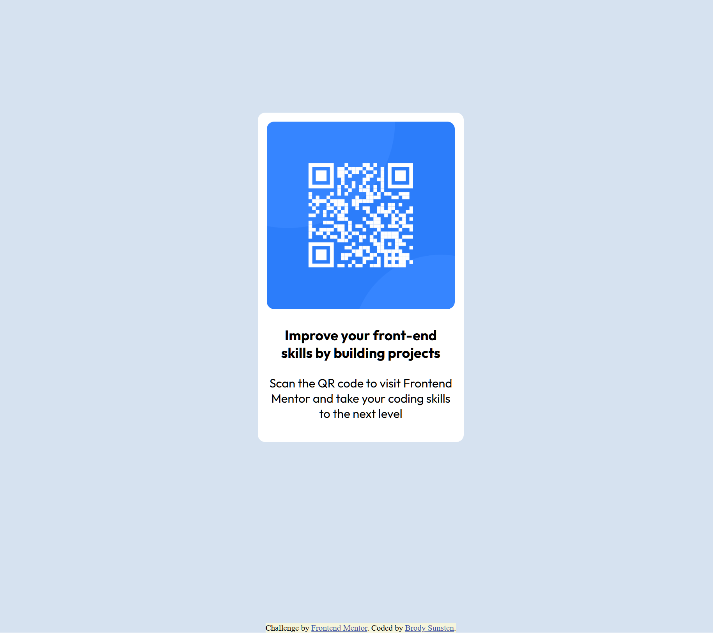

# Frontend Mentor - QR code component solution

This is a solution to the [QR code component challenge on Frontend Mentor](https://www.frontendmentor.io/challenges/qr-code-component-iux_sIO_H).

## Table of contents

- [Overview](#overview)
  - [Screenshot](#screenshot)
  - [Links](#links)
- [My process](#my-process)
  - [Built with](#built-with)
  - [What I learned](#what-i-learned)
  - [Continued development](#continued-development)
  - [Useful resources](#useful-resources)
  - [AI Collaboration](#ai-collaboration)

## Overview
This project was my first return to writing pure HTML and CSS after a long time off. 
I am primarily a C#/.NET developer and am looking to dive back into frontend development
in order to start working on personal full-stack projects. This was the first challenge
I completed on Frontend Mentor. 

### Screenshot

### Links

- Live Site URL: [https://bsunsten.github.io/FMIO-QR-Component/](https://bsunsten.github.io/FMIO-QR-Component/)

## My process
As a simple component I chose to use pure HTML and CSS for this. 
I initially blocked out the content with divs and then focused on proper styling. 
Claude code was a useful tool in figuring out where to look next and reminded me 
of some CSS properties I hadn't used in a while. 

### Built with

- Semantic HTML5 markup
- CSS custom properties
- Flexbox

### What I learned

This project was a good first look back into plain HTML and CSS. 
I was able to gain a better understanding of flexbox and various CSS properties. 

### Continued development

I want to continue developing my understanding of flexbox, especially in combination with CSS Grid. 

### Useful resources

- [CSS-Tricsks Flexbox Guide](https://css-tricks.com/snippets/css/a-guide-to-flexbox/) - This was my primary resource for learning more about flexbox, it made things super intuitive! 
 

### AI Collaboration

- My approach to coding with AI is cautious, as I don't want to be handed an answer. However, using the provided `Agents.md` file I was able to use Claude to explain my thought process and get selective guidance. Claude was able to point out where I was getting off track, or lead me to relevant documentation.  

